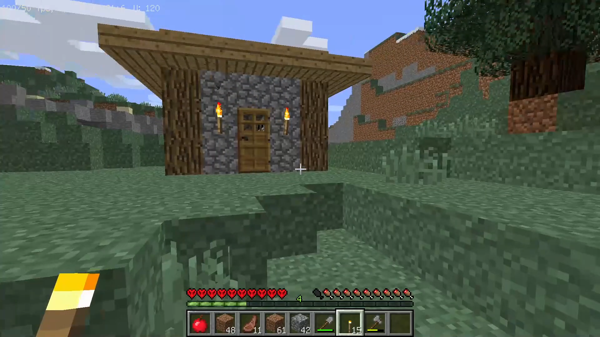

# От первобытности к цивилизации

Это мой видеопроект по технологическому выживанию в игре Minecraft. Я играю в этом мире со множеством технологических модов и выкладываю **MLG-летсплеи** на свои каналы в [Дзене](https://dzen.ru/seriy_mlgamer) и [YouTube](https://youtube.com/@Seriy_MLGamer).

## Цель проекта

* Изучить влияние технологий на прогресс, а также их эффективность в защите от внешних факторов.
* Узнать, способен ли один игрок с помощью технологий делать что угодно и быть неуязвимым.
* Получить эстетическое удовольствие для себя и разделить его с другими.

## Репозиторий

Вы можете **побывать** там, где побывал я, создать свой **путь развития** этого мира. Для этого я решил опубликовать свой мир вместе с его предыдущими версиями, фиксируемыми в системе контроля версий.

* **Название мира**: MLG-хардкор
* **Папка с миром (описание)**: От первобытности до цивилизации
* **Режим игры**: Хардкор
* **Ключ генератора**: -7057243182601242646

Я обещаю не читерить с помощью бэкапов. Тем не менее, гарантий нет.

## Зависимости

Прежде чем играть в этом мире, вам нужно установить следующее ПО.

* Minecraft 1.12.2
* [Forge](https://files.minecraftforge.net/net/minecraftforge/forge/index_1.12.2.html)
* [Технологические моды](https://disk.yandex.ru/d/QPtMsbdz6laZnw)

